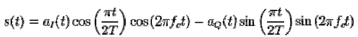

<!DOCTYPE html>
<html lang="en">
<head>
  <meta charset="UTF-8">
  <meta name="viewport" content="width=device-width, initial-scale=1.0">
  <link href="https://cdn.jsdelivr.net/npm/tailwindcss@2.2.19/dist/tailwind.min.css" rel="stylesheet">
</head>
<body>
    

      

        

          

            In digital modulation, minimum-shift keying (MSK) is a type of
            continuous-phase frequency-shift keying Similar to OQPSK, MSK is
            encoded with bits alternating between quadrature components, with
            the Q component delayed by half the symbol period.  
             
            However, instead of square pulses as OQPSK uses, MSK encodes each
            bit as a half sinusoid. This results in a constant-modulus signal,
            which reduces problems caused by non-linear distortion. In addition
            to being viewed as related to OQPSK. MSK can also be viewed as a
            continuous phase frequency shift keyed (CPFSK) signal with a
            frequency separation of one half the bit rate.   
          

          <h3 class="text-[24px] font-semibold text-black">
            Mathematical representation:  
          </h3>
          
The resulting signal is represented by the formula

          

            
          

          

             
            where aI(t) and aQ(t) encode the even and odd information
            respectively with a sequence of square pulses of duration 2T. Using
            the trigonometric identity, this can be rewritten in a form where
            the phase and frequency modulation are more obvious,
             
          

          

            
          

          

             
            where bk(t) is +1 when aI(t) = aQ(t) and -1 if they are of opposite
            signs, and φk is 0 if aI(t) is 1, and π otherwise. Therefore, the
            signal is modulated in frequency and phase, and the phase changes
            continuously and linearly.
             
             
          

          <h3 class="text-[24px] font-semibold text-black py-2">
            Reason for Minimum Shift Keying, MSK  
          </h3>
          

            It is found that binary data consisting of sharp transitions between
            "one" and "zero" states and vice versa potentially creates signals
            that have sidebands extending out a long way from the carrier, and
            this creates problems for many radio communications systems. as any
            sidebands outside the allowed bandwidth cause interference to
            adjacent channels and any radio communications links that may be
            using them.
          

        

      

    

</body>
</html>
